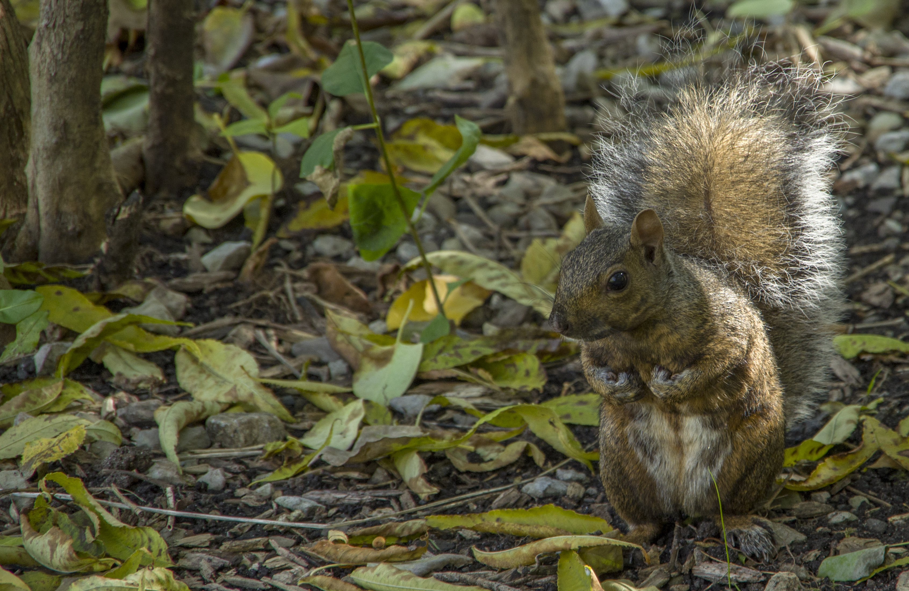

+++
authors = ["William Guimont-Martin"]
title = "Squirrels"
description = "A collection of squirrel photos"
date = 2019-01-28
# updated = ""
# draft = false
[taxonomies]
tags = ["Photos"]
[extra]
# banner = ""
# toc = true
toc_inline = true
toc_ordered = true
# trigger = ""
# disclaimer = ""
+++

Here are some pictures of squirrels I took in the last few years. Most of them are from the *Domaine de Maizerets* in Quebec City.

