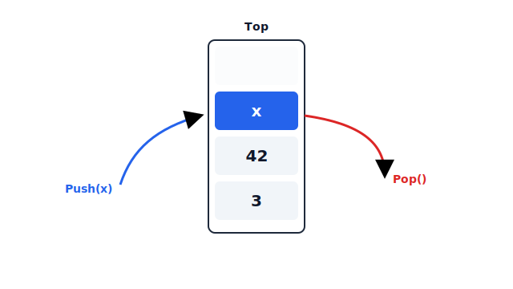

+++
authors = ["William Guimont-Martin"]
title = "Stacks"
description = "Stacks from an abstract data type perspective"
date = 2019-02-15
# updated = ""
# draft = false
[taxonomies]
tags = ["Computer Sciences", "Data Structure"]
[extra]
# banner = ""
toc = true
toc_inline = true
toc_ordered = true
# trigger = ""
# disclaimer = ""
katex = true
+++

Stacks are very much like a stack of plates. When you don't want to do the dishes, you simply *push* the dirty plate on top of the others. Whereas when you are washing them, you take to plate on the top of the stack and proceed to *pop* them all.

In the same way, the stack [abstract data type](@/blog/2019-01-27-abstract-data-type/index.md) allows you to *push* and *pop* elements on the top of the stack.[^Cormen]



We can see a stack as a bottle, you can only access the content from the top.

Since the last element pushed on the stack is the first one to be popped, we say that the stack is a *last in, first out* (LIFO) data structure.

We can define our stack in an imperative manner. Each operation modifies a stack instance.

We could also define the stack in a functional manner. The operations applied to the stack is viewed as a mathematical function that maps the old state to the new state. Refer to the example below for more information.

# Imperative Definitions

An imperative stack has two essential operations:

| Operation           | Description                                                 |
| ------------------- | ----------------------------------------------------------- |
| $\text{Push}(S, x)$ | Add the element $x$ on the stack $S$                        |
| $\text{Pop}(S)$     | Remove the most recently added element to $S$ and return it |
    
We can add non-essential operations to ease programming. We note the non-essential operations:

| Operation    | Description                                                       |
| ------------ | ----------------------------------------------------------------- |
| $\text{Peek}(S)$    | Return the most recently added element in $S$ without removing it |
| $\text{Create}()$   | Create a new Stack                                                |
| $\text{IsEmpty}(S)$ | Return a Boolean value specifying if the stack $S$ is empty       |

As $\text{Peek}(S)$ can be defined in terms of $\text{Push}$ and $\text{Pop}$, we say that this operation is non-essential.

In pseudo code (Python), we could define $\text{Peek}$ as:

```python
def peek(S):
    top_value = pop(S)
    push(S, top_value)
    return top_value
```

## Imperative Implementations

### Stack ADT in C

For simplicity, the stack is implemented with an array, but it could be implemented using a linked list.

```c
// stack.h
#ifndef STACK_H
#define STACK_H

#include <stdlib.h>

typedef struct stack_rep stack_rep;
typedef stack_rep *stack_t;
typedef void *stack_item_t;


stack_t stack_create(unsigned int size);

void stack_free(stack_t s);

void stack_push(stack_t s, stack_item_t x);

stack_item_t stack_pop(stack_t s);

stack_item_t stack_peek(stack_t s);

int stack_empty(stack_t s);

#endif //STACK_H
```

```c
// stack.c
#include "stack.h"

struct stack_rep {
    unsigned int top;
    unsigned int size;
    stack_item_t *elements;
};

stack_t stack_create(unsigned int size) {
    stack_t s = malloc(sizeof(struct stack_rep));
    s->top = 0;
    s->size = size;
    s->elements = malloc(size * sizeof(stack_item_t));
    return s;
}

void stack_free(stack_t s) {
    if (s) {
        free(s->elements);
        free(s);
    }
}

void stack_push(stack_t s, stack_item_t x) {
    if (s->top < s->size) {
        s->elements[s->top] = x;
        s->top++;
    }
}

stack_item_t stack_pop(stack_t s) {
    if (!stack_empty(s))
        s->top--;
}

stack_item_t stack_peek(stack_t s) {
    if (!stack_empty(s))
        return s->elements[s->top - 1];
    else
        return NULL;
}

int stack_empty(stack_t s) {
    return s->top == 0;
}

```

```c
// main.c
#include <stdio.h>

#include "stack.h"

int main() {
    stack_t stack = stack_create(4);

    const int numValue = 4;
    int values[] = {1, 2, 3, 4};

    printf("Is stack empty: %s\n", stack_empty(stack) ? "true" : "false");

    for (int i = 0; i < numValue; ++i) {
        printf("Pushing: %d\n", values[i]);
        stack_push(stack, values + i);
    }

    printf("Is stack empty: %s\n", stack_empty(stack) ? "true" : "false");

    for (int i = 0; i < numValue; ++i) {
        int popped = *(int*)stack_peek(stack);
        printf("Popping: %d\n", popped);
        stack_pop(stack);
    }

    printf("Is stack empty: %s\n", stack_empty(stack) ? "true" : "false");

    stack_free(stack);
    return 0;
}

```

Note that from the user point of view, `stack_t` is completely opaque to the user. Only stack.c knows the inner representation of `stack_t`, since we only declared `stack_t` in stack.h.

We could completely change the implementation detail and nothing would change from the user point of view.

Notice that we pass the stack to the function so that they know on which instance work. This is akin to Python self.

```python
class ValuePrinter:
    def __init__(self, value):
        self.value = value

    def print_value(self):
        print(self.value)

```

The self argument is passed automatically to the object when calling the function on the instance. Both lines are equivalents.

```python
vp = ValuePrinter(42)
vp.print_value()  # prints 42
ValuePrinter.print_value(vp)  # prints 42 too
```

Note that the two statements are equivalent because we know that print_value is not overridden. That way we are sure that `vp.print_value()` is equivalent to `ValuePrinter.print_value(vp)`.

### Object Oriented Stack in Java

```java
// Stack.java
package io.github.willguimont;

public interface Stack<T> {

    class FullStackException extends RuntimeException {

    }

    class EmptyStackException extends RuntimeException {

    }

    void push(T element);

    void pop();

    T peek();

    boolean isEmpty();
}

```

```java
// StackArray.java
package io.github.willguimont;

public class StackArray<T> implements Stack<T> {

    private Object[] elements;
    int top;
    int size;

    public StackArray(int size) {
        elements = new Object[size];
        top = 0;
        this.size = size;
    }

    @Override
    public void push(T element) {
        if (top < size) {
            elements[top] = element;
            top++;
        } else
            throw new FullStackException();
    }

    @Override
    public void pop() {
        if (isEmpty())
            throw new EmptyStackException();
        top--;
    }

    @Override
    public T peek() {
        if (isEmpty())
            throw new EmptyStackException();
        else
            return (T) elements[top - 1];
    }

    @Override
    public boolean isEmpty() {
        return top == 0;
    }
}

```


```java
// StackList.java
package io.github.willguimont;

import java.util.LinkedList;
import java.util.List;

public class StackList<T> implements Stack<T> {

    private List<T> elements;
    private int size;

    public StackList() {
        elements = new LinkedList<>();
    }

    @Override
    public void push(T element) {
        elements.add(element);
        size++;
    }

    @Override
    public void pop() {
        if (isEmpty())
            throw new EmptyStackException();
        elements.remove(size - 1);
        size--;
    }

    @Override
    public T peek() {
        if (isEmpty())
            throw new EmptyStackException();
        else
            return elements.get(elements.size() - 1);
    }

    @Override
    public boolean isEmpty() {
        return elements.isEmpty();
    }
}
```

```java
// Main.java
import io.github.willguimont.*;

public class Main {

    public static void main(String[] args) {
        // Both work
        //Stack<Integer> stack = new StackArray<Integer>(10);
        Stack<Integer> stack = new StackList<>();

        int[] values = {1, 2, 3, 4};

        System.out.println("Is stack empty: " + stack.isEmpty());

        for (int i = 0; i < values.length; ++i) {
            System.out.println("Pushing value: " + values[i]);
            stack.push(values[i]);
        }

        System.out.println("Is stack empty: " + stack.isEmpty());

        for (int i = 0; i < values.length; ++i) {
            int value = stack.peek();
            System.out.println("Popping value: " + value);
            stack.pop();
        }

        System.out.println("Is stack empty: " + stack.isEmpty());
    }
}

```

Note how easy it is to add new represents of the stack. This is one of the strong points of object-oriented programming compared to ADT.

Here the stack is defined with an interface that differs from the way we defined `stack_t` in C. `stack_t` is an opaque type that only the operations know the inner details, whereas the interface declares the methods a stack has to implement.

For more information on the comparison of ADT and object, see [Introduction to Abstract Data Types](@/blog/2019-01-27-abstract-data-type/index.md).

# Functional Definitions

On the contrary to the imperative stack, a functional implementation doesn't mutate the state of the stack. Instead, the operations are seen as mathematical functions that map from the old state to the new frame. 

Much like a function $ f(x) = x^{2} $ that maps a value $x$ to its square. The initial value of $x$ stays unchanged.

In a functional paradigm, we need three operations to fully define a stack.

$\text{Push}(S, x)$: Returns a new stack with an element $x$ pushed on top of $S$

$\text{Pop}(S)$: Return the stack $S$ without its first element

$\text{Top}(S)$: Returns the value on top of $S$

Note that we don't need a $\text{Create}$ operation because there is no instance. Instead, we define a special state $\Lambda$ (or **empty**) that represents the empty state.

Also note that we don't need an $\text{isEmpty}$ operation either, because we can simply test the equality to $\Lambda$.

## Functional Implementations in Haskell

This bit of code is adapted from <a class="external" href="https://haskell.org" target="_blank">haskell.org</a>[^Haskell].

```haskell
-- stack.hs
module Stack (Stack, empty, isEmpty, push, top, pop) where
 
empty :: Stack a
isEmpty :: Stack a -> Bool
push :: a -> Stack a -> Stack a
top :: Stack a -> a
pop :: Stack a -> (a,Stack a)
    
newtype Stack a = StackImpl [a]

empty = StackImpl []
isEmpty (StackImpl s) = null s
push x (StackImpl s) = StackImpl (x:s)
top (StackImpl s) = head s
pop (StackImpl (s:ss)) = (s,StackImpl ss)
```


```haskell
-- main.hs
import Stack
import Control.Monad (unless)

printStack :: (Show a) => Stack a -> IO()
printStack x = unless (isEmpty x) $ do
    let (a, s) = pop x
    print a
    printStack s

main :: IO()
main = do
    let stack = foldl (flip push) empty [1, 2, 3, 4]
    printStack stack
```

Note here that this code is much shorter and that the stacks aren't mutated, instead, the functions return a new stack each time.

# Summary

Stacks are an elementary data structure. They are fundamentals in computer science. We note their uses in multiples places such as <a class="external" href="https://en.wikipedia.org/wiki/Sudoku_solving_algorithms#Backtracking" target="_blank">solving sudokus using backtracking algorithms</a>, recursion, converting equations to <a class="external" href="https://en.wikipedia.org/wiki/Reverse_Polish_notation" target="_blank">reverse Polish notation</a> and much more. We even see stacks used in how CPUs handle subroutines. They truly are fundamental to the computer science field, from the theoretical to the practical.

# References

[^Cormen]: Thomas H. Cormen et al. Introduction to Algorithms. 2009.
[^Haskell]: Haskell org. <a class="external" href="https://wiki.haskell.org/Abstract_data_type" target="_blank">Abstract Data Types</a>. 2014.
