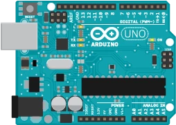
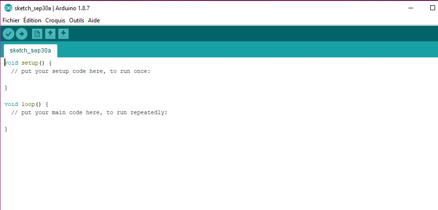
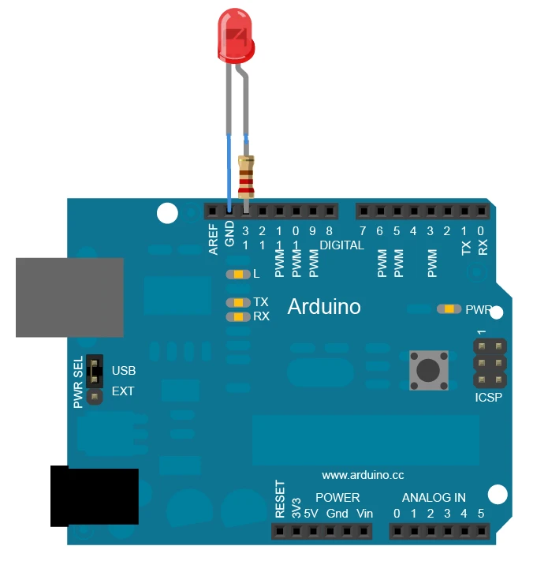
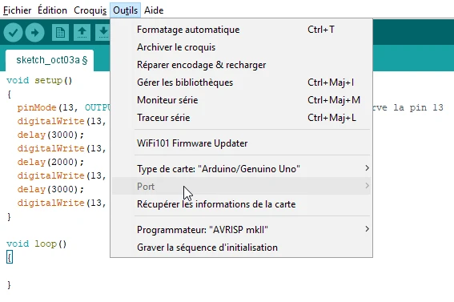

+++
authors = ["William Guimont-Martin"]
title = "Introduction à Arduino"
description = "Une introduction à la plateforme Arduino et à ses concepts de base."
date = 2019-03-01
# updated = ""
# draft = false
[taxonomies]
tags = ["Computer Sciences", "French", "Tutorial", "Arduino"]
[extra]
# banner = ""
toc = true
toc_inline = true
toc_ordered = true
# trigger = ""
# disclaimer = ""
+++

# Qu'est-ce qu'Arduino



> The UNO is the best board to get started with electronics and coding. If this is your first experience tinkering with the platform, the UNO is the most robust board you can start playing with. The UNO is the most used and documented board of the whole Arduino family.
>
> -- Site officiel Arduino.cc

Il s'agit d'une carte comprenant un micro-contrôleur. La puce sur la carte est un petit ordinateur que l'on peut programmer. Il y a un port USB pour envoyer le code sur la puce et communiquer avec un ordinateur. Les pins sur le côté permettent d'avoir des entrées-sorties vers le vrai monde. On peut activer des lumières et des moteurs. On peut aussi lire les données envoyées par un capteur de distance à l'ultrason ou une photorésistante pour savoir s'il fait noir. 

# Introduction à la programmation

Un programme est une suite d'instructions exécutées les unes après les autres. On peut voir un programme comme une recette très précise pour réaliser des choses.

On pourrait vouloir donner la suite d'étape pour faire un sandwich au beurre d'arachides. On pourrait essayer de demander à l'ordinateur de faire:

1. Faire un sandwich au beurre d'arachide

Toutefois, l'ordinateur ne comprend pas comment faire cela. On devrait alors décrire les étapes de façon plus précises de façon à ce que l'ordinateur comprenne. On aurait alors:

1. Ouvrir le sac contenant le pain
2. Sortir une tranche de pain
3. Sortir le pot de beurre d'arachide de l'armoire
4. Sortir un couteau
5. Ouvrir le pot
6. Tartiner le pain avec le couteau
7. Sortir une seconde tranche de pain
8. Placer la tranche sur l'autre qui est déjà beurrée

Ouf ! C'est beaucoup d'étapes pour un simple sandwich.
Pour programmer un robot, c'est très semblable. On ne peut pas dire au robot de:

1. Avancer pendant 10 secondes

Il faut plutôt lui dire:

1. Actionne les moteurs
2. Attendre 10 secondes
3. Arrête les moteurs

# DEL et Arduino

`DEL`: `D`iode `É`lectro `L`uminescente


En bref, une DEL est une lumière qui ne demande que très peu d'énergie. On peut donc l'alimenter directement depuis l'Arduino.

Si l'on applique une tension aux deux bornes de la DEL, elle s'allumera.

Une DEL a deux "pattes". L'une d'elles est légèrement plus longue, il s'agit de la patte positive. L'autre est la négative. Lors du branchement, il faut faire attention de bien brancher la DEL.

# Faire clignoter une DEL

On voudrait demander à l'Arduino de faire clignoter une la DEL deux fois en la laissant 2 secondes éteintes et 3 secondes allumées. En mots, on aurait:

1. Allumer la DEL
2. Attendre 3 secondes
3. Éteindre la DEL
4. Attendre 2 secondes
5. Allumer la DEL
6. Attendre 3 secondes
7. Éteindre la DEL

## Télécharger Arduino

Il est maintenant temps d'essayer de demander à l'Arduino de faire ces étapes. Téléchargeons le logiciel depuis <a class="external" href="https://www.arduino.cc/en/main/software" target="_blank">le site officiel d'Arduino</a>.

On peut télécharger le ZIP ne demandant pas d'installation à cette <a class="external" href="https://www.arduino.cc/download_handler.php" target="_blank">adresse</a>.

On peut maintenant lancer l'application.

## Premiers pas en Arduino



On voit maintenant un code de base fournit par Arduino.

```c++
void setup() {
  // put your setup code here, to run once:

}

void loop() {
  // put your main code here, to run repeatedly:

}
```

`setup` est exécuté qu'une fois au démarrage de l'Arduino.

`loop` est ensuite exécuté continuellement.

Toutefois, avant de commencer à coder, branchons la DEL dans l'Arduino.



Dans le cadre de ce document, nous allons utiliser la **pin** numéro 13. Vous pouvez en choisir une autre si vous voulez. La longue patte doit être connectée dans la pin 13 et la courte au ground. Le **ground** est le 0 volt de référence de l'Arduino.

Pour empêcher de brûler la DEL, on place une résistance en **série** avec la DEL. La résistance doit être entre 220 et 280 Ohms. Elle peut être placée avant ou après la DEL.

### Fonctions de base

Pour faire clignoter une DEL, on doit pouvoir être capable de l'allumer, de l'éteindre et d'attendre. Nous allons voir comment réaliser ces actions dans Arduino.

#### Configuration de la DEL

On doit indiquer à l'Arduino quelles pins on désire utiliser, dans notre cas il s'agit de la pin 13. On appelle alors la fonction suivante:

```c++
pinMode(13, OUTPUT);
```

`OUTPUT` signifie que l'on veut se servir de la pin comme d'une sortie, donc mettre une certaine tension à la pin plutôt que de lire la tension. On aurait pu utiliser `INPUT` pour initialiser la pin comme une entrée. Nous allons en voir une exemple par la suite.

#### Allumer la DEL

Pour allumer la DEL, on doit mettre une certaine tension aux bornes de la DEL. Comme la patte négative est branchée au ground, on doit appliquer un voltage positif à la patte branchée dans la pin 13. Pour ce faire, on utilise la fonction suivante:

```c++
digitalWrite(13, HIGH);
```

`HIGH` signifie une tension positive. Dans le cas d'une Arduino UNO, on met 5 volts sur la pin 13.

#### Éteindre la DEL

Pour l'éteindre, on procède de façon semblable.

```c++
digitalWrite(13, LOW);
```

#### Attendre

Pour attendre un certain temps, on utilise la fonction:

```c++
delay(1000);
```

Ici, 1000 représente le temps à attendre en millisecondes. On a qu'une seconde est 1000 ms. Par exemple, pour attendre 5 secondes, on devrait indiquer 5000 ms.

### Mettre le tout ensemble

Reprenons la liste d'étapes à suivre pour faire clignoter notre DEL:

1. Allumer la DEL
2. Attendre 3 secondes
3. Éteindre le DEL
4. Attendre 2 secondes
5. Allumer la DEL
6. Attendre 3 secondes
7. Éteindre la DEL

On peut maintenant "traduire" chaque étape en code. Il manque toutefois l'initialisation de la pin au début. Avec les informations un peu plus haut, on peut maintenant coder notre Arduino.

```c++
void setup() 
{
  pinMode(13, OUTPUT);     // 0. On dit a l'Arduino que l'on réserve la pin 13
  digitalWrite(13, HIGH);  // 1. Allumer la DEL
  delay(3000);             // 2. Attendre 3 secondes
  digitalWrite(13, LOW);   // 3. Éteindre le DEL
  delay(2000);             // 4. Attendre 2 secondes
  digitalWrite(13, HIGH);  // 5. Allumer la DEL
  delay(3000);             // 6. Attendre 3 secondes
  digitalWrite(13, LOW);   // 7. Éteindre le DEL
}

void loop() 
{

}
```

On peut maintenant connecter l'Arduino par USB à l'ordinateur.

On doit premièrement vérifier que l'Aduino est connectée dans Outils -> Port. Il faut s'assurer que le port selectionné est bien celui de l'Arduino.



On peut envoyer le code sur l'Arduino avec le bouton "Téléverser" (la flèche vers la droite). Après un certain temps, l'Arduino devrait faire clignoter la DEL deux fois selon les délais définit.

## À l'infini

Et si on désirait faire clignoter le DEL à l'infini? Il faudrait demander à l'Arduino de la faire clignoter pleins de fois. On pourrait avoir:

```c++
void setup() 
{
  pinMode(13, OUTPUT);     // 0. On dit a l'Arduino que l'on réserve la pin 13
  digitalWrite(13, HIGH);  // 1. Allumer la DEL
  delay(3000);             // 2. Attendre 3 secondes
  digitalWrite(13, LOW);   // 3. Éteindre le DEL
  delay(2000);             // 4. Attendre 2 secondes
  digitalWrite(13, HIGH);  // 5. Allumer la DEL
  delay(3000);             // 6. Attendre 3 secondes
  digitalWrite(13, LOW);   // 7. Éteindre le DEL
  //
  digitalWrite(13, HIGH);  
  delay(3000);             
  digitalWrite(13, LOW); 
  delay(2000);             
  digitalWrite(13, HIGH);  
  delay(3000);           
  digitalWrite(13, LOW);   
  //
  digitalWrite(13, HIGH);  
  delay(3000);             
  digitalWrite(13, LOW); 
  delay(2000);             
  digitalWrite(13, HIGH);  
  delay(3000);           
  digitalWrite(13, LOW);   
  //
  digitalWrite(13, HIGH);  
  delay(3000);             
  digitalWrite(13, LOW); 
  delay(2000);             
  digitalWrite(13, HIGH);  
  delay(3000);           
  digitalWrite(13, LOW);   
  //....
}

void loop() 
{

}
```

Et on devrait continuer ainsi pendant longtemps... Heureusement, il y a une meilleure façon !

La fonction loop est exécutée continuellement après setup, il suffit donc d'avoir le code suivant:

```c++
void setup() 
{
  pinMode(13, OUTPUT);     // 0. On dit a l'Arduino que l'on réserve la pin 13
}

void loop() 
{
  digitalWrite(13, HIGH);  // 1. Allumer la DEL
  delay(3000);             // 2. Attendre 3 secondes
  digitalWrite(13, LOW);   // 3. Éteindre le DEL
  delay(2000);             // 4. Attendre 2 secondes
}
```

On a donc que la lumière s'allume pour 3 secondes, et s'éteint pendant 3 secondes à l'infini. On remarque qu'il y a moins de code **copier-collé** !
