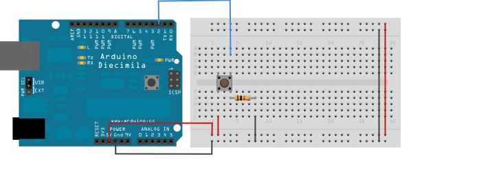
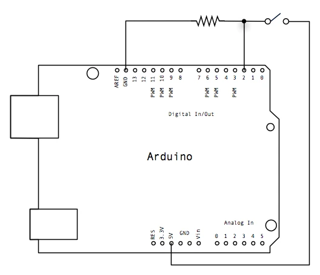
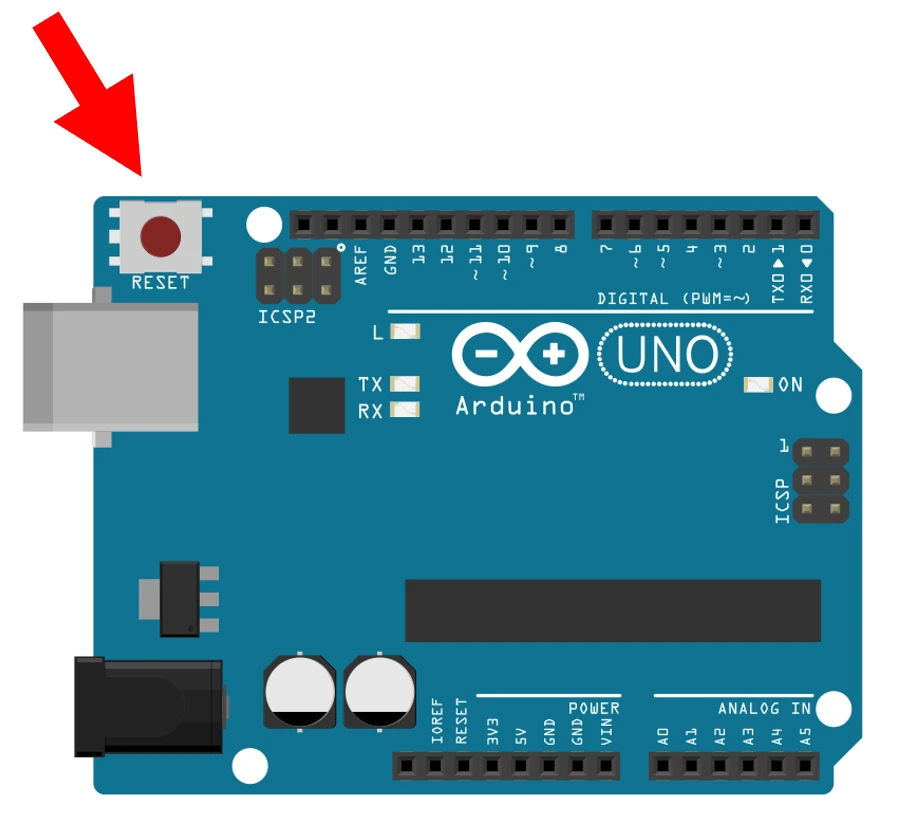

+++
authors = ["William Guimont-Martin"]
title = "Introduction aux conditions et à la boucle principale"
description = "Cet article présente les concepts de conditions et de boucles dans le contexte de la programmation Arduino."
date = 2019-03-02
# updated = ""
# draft = false
[taxonomies]
tags = ["Computer Sciences", "French", "Tutorial", "Arduino"]
[extra]
# banner = ""
toc = true
toc_inline = true
toc_ordered = true
# trigger = ""
# disclaimer = ""
+++

Dans l'article précédant, nous avons vu comment faire clignoter une DEL 2 fois avant de s'éteindre. Maintenant, essayons de n'allumer la DEL que lorsqu'un bouton est enfoncé.

En mots, on voudrait demander à l'Arduino:

1. Si le bouton est enfoncé
   1. Allumer la DEL
   2. Attendre 3 secondes
   3. Éteindre la DEL
2. Sinon
   1. Laisser la DEL éteinte

Pour ce faire, on branche un bouton de la façon suivante.



Les zig-zags représentent la résistance. Le symbole avec les deux points vides et le bout de fil représente un bouton ou un interrupteur.



## Fonctions de bases

### Pin en lecture

```c++
pinMode(2, INPUT);
```

Cette fonction permet de mettre la pin 2 en mode lecture.

### Lecture d'une pin

```c++
digitalRead(2);
```

Cette fonction retourne `HIGH` si la tension est près de 5V sur la pin, ou `LOW` si la tension est près de 0V.

## Variables

On aimerait pouvoir garder l'état du bouton pour pouvoir comparer sa valeur. Pour ce faire, on utilise des variables. Les variables sont comme des boîtes. On peut donner un nom à la boîte et mettre une valeur dedans.

On peut demander à l'Arduino de nous créer une boîte avec un certain nom. On peut ensuite mettre une valeur à l'intérieur. Si on veut, on peut mettre une autre valeur dans la boîte par la suite.

### Exemple

```c++
int maVariable;
maVariable = 4;
maVariable = 2;
maVariable = maVariable + 1;
```

`int` correspond au type de la variable. maVariable est donc de type int. int veut dire integer, c'est-à-dire entier en français. Un nombre entier sont des nombres comme 0, 1, 2, 3, 4, -3, 42 et -245. On a donc que maVariable peut contenir des nombres entiers.
On commence par donner la valeur 4 à maVariable.
Ensuite, on change cette valeur pour 2.
Ensuite, on met dans maVariable la valeur de maVariable + 1. Comme maVariable valait 2, on a que maVariable est maintenant 2 + 1, donc 3.

On remarque que le signe = n'a pas le même sens qu'en mathématique. En mathématique, il serait faux de dire 2 = 3. Dans notre cas, on **assigne** la valeur de droite à la variable de gauche.

**Remarque**: On aurait pu utiliser n'importe quel autre nom pour la variable.

**Remarque**: D'autres opérateurs que l'addition (`+`) sont définis, on peut faire des soustractions (`-`), des multiplications (`*`), des division (`/`) et le modulo (`%`). La division est toutefois tronqué avec des `int` puisqu'un `int` ne peut contenir que des nombres entiers. Le modulo calcule le reste de la division. Pour le moment, ne vous inquiétez pas avec cela.

## Storer l'état du bouton dans une variable

Maintenant que nous savons ce qu'est une variable et comment récupérer l'état du bouton, sauvegardons l'état du bouton dans une variable.

```c++
pinMode(2, INPUT);                 // pin 2 en lecture
int etatBouton = digitalRead(2);   // mettre l'etat du bouton dans etatBouton
```

Voilà, nous avons l'état du bouton dans etatBouton.

## Conditions

Maintenant que nous avons l'état du bouton dans une variable, on aimerait pouvoir réaliser certaines actions `SI` une condition est vraie et d'autres `SINON`.

Il existe en C++ une façon de réaliser des branchements conditionnelles, c'est-à-dire de faire certaines chose si la condition est vraie. En voici un exemple simple:

```c++
int x = 5;
if (x < 10)
{
    x = 10;
}
```

if veut dire si en français. Si on lit le code en français, on a:

1. Créer une variable nommée x et mettre 5 dedans
2. Si x **est plus petit que** 10 alors
   1. On mets 10 dans x

Comme 5 est plus petit que 10, on a que la valeur de x est maintenant 10.

Voici un second exemple:

```c++
int x = 42;
if (x == 42)
{
    x = x - 10;
}
```

if veut dire si en français. Si on lit le code en français, on a:

1. Créer une variable nommée x et mettre 42 dedans
2. Si x **est égal à** 42 alors
   1. On mets x - 10 dans x

Comme x est bien égal à 42, on soustrait 10 à x. x a donc la valeur de 32 après l'exécution.

**Remarque**: `==` veut dire **est égal à**, à ne pas confondre avec = qui veut dire assigner

Disons que nous voulons réaliser ceci:

1. Soit un entier x qui vaut 39
2. Si x == 42
   1. x = x - 10
3. Sinon
   1. x = 0

Comment pouvons nous traduire cela en code?
Il existe le mot-clef `else` qui fait exactement cela.

On aurait alors

```c++
int x = 39;
if (x == 42)
{
    x = x - 10;
}
else
{
    x = 0;
}
```
Comme `x = 39`, on a que la condition `x == 42` est fausse, donc on n'exécute pas `x = x - 10`, on entre ensuite dans le else où on assigne 0 à `x`.

Maintenant que nous savons comment faire des conditions, on peut allumer la DEL si l'état du bouton est à HIGH.

```c++
void setup() 
{
  pinMode(13, OUTPUT);
  pinMode(2, INPUT);                 // pin 2 en lecture
  int etatBouton = digitalRead(2);   // mettre l'etat du bouton dans etatBouton
  if (etatBouton == HIGH)
  {
    digitalWrite(13, HIGH); // Si le bouton est a HIGH, on allume
  }
  else
  {
    digitalWrite(13, LOW); // Sinon on laisse éteint
  }
}

void loop()
{
}
```

Il y a toutefois un petit problème, la lumière ne s'allume ou ne s'éteint qu'au démarrage de l'Arduino. Pour changer l'état de la lumière, il faut appuyer sur le bouton, puis redémarrer l'Arduino avec le bouton reset. Ce n'est pas très pratique. On aimerait que cela se fasse en tout temps.



Pour palier à ce problème, on peut utiliser `loop`. Comme son nom l'indique, `loop` est une boucle, c'est-à-dire que le code dans cette fonction s'exécute continuellement après l'exécution de `setup`. Déplaçons donc ce qui doit être exécuté plusieurs fois dans `loop`.

```c++
void setup() 
{
  pinMode(13, OUTPUT);  // pin 13 en sortie
  pinMode(2, INPUT);    // pin 2 en lecture
}

void loop() 
{
  int etatBouton = digitalRead(2);   // mettre l'etat du bouton dans etatBouton
  if (etatBouton == HIGH)
  {
    digitalWrite(13, HIGH); // Si le bouton est a HIGH, on allume
  }
  else
  {
    digitalWrite(13, LOW); // Sinon on laisse éteint
  }
}
```

On remarque que les `pinMode` sont restés dans `setup`. En effet, on ne veut réserver ces pin qu'une seule fois.

Alors que le `if` et `else` a été déplacé dans loop, puisque l'on veut continuellement vérifier si le bouton est enfoncé.

Maintenant, on a que la lumière s'allume et s'éteint dès que l'on appuie ou relâche le bouton.
