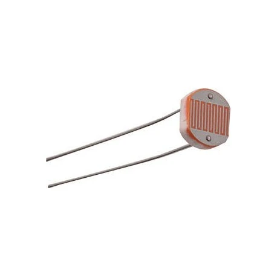

+++
authors = ["William Guimont-Martin"]
title = "Exercice conditions avec des photorésistances"
description = "Cet exercice vous permettra de mettre en pratique les conditions et la boucle principale en utilisant des photorésistances."
date = 2019-03-03
# updated = ""
# draft = false
[taxonomies]
tags = ["Computer Sciences", "French", "Tutorial", "Arduino"]
[extra]
# banner = ""
toc = true
toc_inline = true
toc_ordered = true
# trigger = ""
# disclaimer = ""
+++

Le but de cet exercice est de vous faire pratiquer les conditions et la boucle principale. De plus, vous aurez la chance de vous pratiquer à lire de la documentation.

## Photorésistance

Une photorésistance est une composante électronique dont la résistance change selon la lumière qui l'éclaire. En bref, on peut regarder la tension aux bornes de la photorésistance.

## But de l'exercice

Écrivez le code pour qu'une DEL s'allume lorsque la photorésistance est à l'ombre et éteindre la DEL lorsqu'elle est éclairée.

## Liens utiles

<a class="external" href="https://www.arduino.cc/reference/en/language/functions/analog-io/analogread/" target="_blank">analogRead</a>

<a class="external" href="https://www.arduino.cc/en/Serial/Println" target="_blank">Serial pour afficher des informations à l'écran</a>
