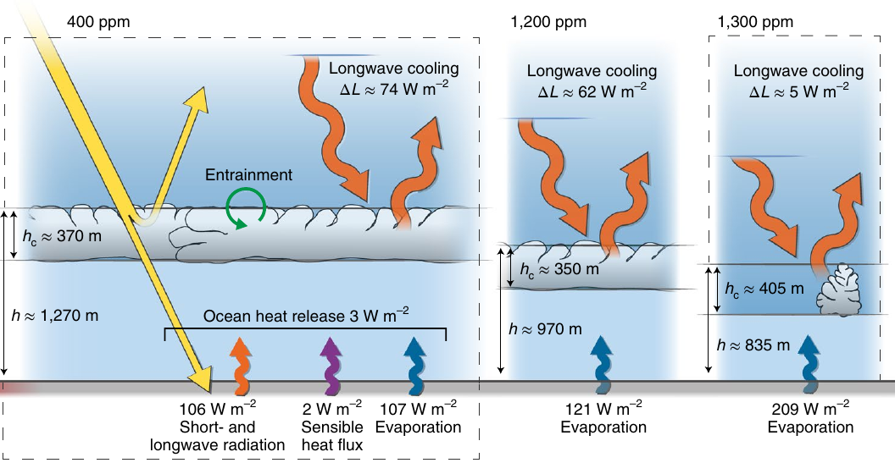

+++
authors = ["William Guimont-Martin"]
title = "Des crocodiles et des tortues dans l’arctique canadien?"
description = "Le passé tropical de l’Arctique canadien"
date = 2020-04-28
# updated = ""
# draft = false
[taxonomies]
tags = ["Sciences", "French", "Climate"]
[extra]
# banner = ""
# toc = true
toc_inline = true
toc_ordered = true
# trigger = ""
# disclaimer = ""
+++

Quand on pense aux îles de l’archipel arctique canadien, on ne s’imagine pas un décor rempli de palmiers, de crocodiles et de tortues. 

Pourtant, c’était à cela que l’on pouvait s’attendre à l’époque de l’Éocène, qui s’étend d’il y a 56 à 33,9 millions d’années. Du pollen de palmiers fossilisés [^Sluijs] et des fossiles de crocodiles et de tortues ont été retrouvés sur les îles d’Ellesmere et d’Axel Heiberg [^Everle], deux îles du cercle polaire. Ces fossiles nous renseignent beaucoup sur le climat passé de ces îles. Effectivement, ces fossiles viennent d’animaux et de plantes peu résistants au froid ; le climat pendant l’Éocène devait être beaucoup plus chaud qu’aujourd’hui.

Il n’y a qu’un seul problème, les scientifiques ne savent pas comment expliquer ce réchauffement. Des simulations de climat par ordinateurs ont montré que pour atteindre des températures pouvant accueillir ces animaux subtropicaux, il faut des concentrations en CO2 de près de 4000 parties par millions (ppm), ce qui contredit les quelque 2000 ppm estimées selon des reconstructions de l’époque. Les simulations doivent alors faire des erreurs dans leurs approximations. 

Les nuages ont un impact important sur le climat et sont très difficiles à simuler. Les nuages participent à refroidir la Terre en reflétant une partie de l’énergie solaire vers l’espace. Les stratocumulus couvrent près de 20 % des océans dans les régions subtropicales, donc s’il existe un mécanisme encore méconnu qui influence la présence de nuages, l’impact serait très important sur le climat. C’est justement ce que Schneider et al. ont investigué dans leur article scientifique *Possible climate transitions from breakup of stratocumulus decks under greenhouse warming*[^Schneider].

> **Stratocumulus**
>
> *Stratos*: Bas de l'atmosphère
>
> *Cumulus*: Forme arrondie
>
> *Stratocumulus*: nuage bas dans l'atmosphère de forme arrondie

Pour bien comprendre pourquoi les simulations échouent à modéliser ce réchauffement de l’Arctique pendant l’Éocène, il faut savoir comme ces simulations fonctionnent. Pour simuler le climat, on doit résoudre plein d’équations qui décrivent la physique, les mouvements des fluides et la chimie de l’atmosphère. Or, ces équations sont dures à résoudre, surtout à l’échelle de la Terre. On doit alors faire des approximations. On découpe la Terre, son atmosphère et ses océans en une grille 3D de l’ordre de la dizaine de kilomètres. On résout alors les équations pour chaque cube de la grille et on modélise les interactions entre les cubes. Ces simulations se nomment des modèles de climat globaux. 

Certains processus se déroulent à des échelles de distance ou de temps trop petites, comme les stratocumulus, pour être correctement modélisés. On a alors recours à des simplifications, appelées des paramétrisations. Ces paramétrisations sont reconnues comme étant peu précises. Alors si on veut modéliser correctement les stratocumulus, il faut utiliser des simulateurs plus fins.

On peut utiliser des simulations des grandes structures de la turbulence, ou Large Eddy Simulation (LES) en anglais. Ces simulations ont une résolution plus fine et permettent de simuler les nuages dans une région donnée.

La simulation globale et la LES s’influent l’une l’autre pour obtenir des simulations plus réalistes.

Maintenant que l’on sait comment on peut simuler les stratocumulus, il faut comprendre leurs dynamiques. Comme on peut le voir dans la partie de gauche de la figure ci-dessous, le nuage est bordé par le haut par une masse d’air chaud et sec, et par le bas par de l’air humide venant de l’océan. Les gouttelettes d’eau du nuage sont très efficaces pour absorber et émettre les radiations à ondes longues, contrairement à l’air sec et chaud au-dessus du nuage. On a donc que les radiations à ondes longues viennent de régions plus hautes et plus froides de l’atmosphère. Le nuage reçoit moins d’énergie par rapport à ce qu’il émet, il refroidi donc. L’air froid du dessus du nuage est alors plus dense que le nuage. Étant plus dense, cet air commence à descendre dans le nuage, entraînant du même coup de l’air chaud et sec du dessus du nuage à l’intérieur. Cette convection permet aussi à l’air humide du dessous du nuage d’humidifier le nuage. Ces différents échanges permettent au nuage de rester présent.

| | 
|:--:| 
| *Échanges de chaleurs dans les stratocumulus, figure extraite de [^Schneider]* |

Si on augmente la concentration en CO2, l’air au-dessus du nuage devient moins transparent aux radiations à ondes longues. Les radiations viennent alors de plus régions plus basses et chaudes de l’atmosphère. Les nuages reçoivent alors plus d’énergie. Recevant davantage de radiations, le nuage refroidit moins, ce qui limite la convection qui permet au nuage de s’approvisionner en humidité, ce qui rend le nuage instable. 

Aussi, comme la température de l’eau est plus élevée, il y a davantage d’évaporation. Lorsque l’eau se condense dans l’air, elle libère de la chaleur, ce qui chauffe le nuage par en dessous. Ceci augmente la force des turbulences qui apportent de l’air chaud et sec dans le nuage, désintégrant le nuage du même coup.
Si la concentration en CO2 augmente, il y aura alors moins de stratocumulus.

Les simulations commencent avec une concentration de CO2 semblable aux niveaux actuels, soit environ 400 ppm. Les chercheurs ont alors augmenté la concentration de CO2. Au fur et à mesure que la concentration augmente, on note que l’humidité dans les nuages diminue jusqu’à ce qu’ils se désintègrent à des concentrations supérieures à 1200 ppm. Dès lors, comme il y a moins de nuages, moins d’énergie est reflétée vers l’espace. La température de l’eau à la surface aux tropiques augmente de 8°C et de 10°C dans les régions subtropicales.

Donc, la disparition des nuages avec l’augmentation de CO2 dans l’atmosphère pourrait expliquer pourquoi l’on retrouvait autrefois des palmiers et des crocodiles dans l’Arctique canadien.

Selon les estimations des chercheurs, on pourrait atteindre ce point si l’on continue de produire des gaz à effet de serre à notre rythme présent en une centaine d’années. On note aussi que le retour en arrière n’est pas aussi facile que de diminuer la concentration sous 1200 ppm. Selon leurs simulations, les nuages ne reviennent que lorsque la concentration tombe sous les 300 ppm.

# Références
Source principale: Schneider[^Schneider].

Lecture intéressante: Silberg[^Silberg].

[^Schneider]: T. Schneider, C. M. Kaul, K. G. Pressel, 2019. Possible climate transition from breakup of stratocumulus decks under greenhouse warming. Nature Geoscience. 2019.
[^Everle]: J. Everle, M. D. Gottfried, J. H. Hutchison, C. A. Brochu, 2014. First Record of Eocene Bony Fishes and Crocodyliforms from Canada’s Western Arctic. Public Library of Science. 2014.
[^Sluijs]: A. Sluijs, S. Schouten, T. H. Donders et al. 2009.  Warm and wet conditions in the Arctic region during Eocene Thermal Maximum 2. Nature Geoscience. 2019
[^Silberg]: Silberg, Bob. 2020. Clouds, Arctic Crocodiles and a New Climate Model. NASA : Globa Climate Change. https://climate.nasa.gov/news/2936/clouds-arctic-crocodiles-and-a-new-climate-model/.
