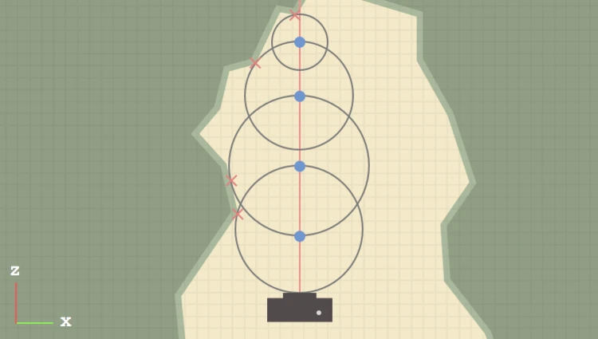

+++
authors = ["William Guimont-Martin"]
title = "Ray marching"
description = "Une autre technique de rendu basée sur le lancer de rayons"
date = 2021-03-16
# updated = ""
# draft = false
[taxonomies]
tags = ["Computer Graphics", "French"]
[extra]
# banner = ""
# toc = true
toc_inline = true
toc_ordered = true
# trigger = ""
# disclaimer = ""
katex = true
+++

Ce post est un court résumé d'un article que j'ai écrit dans le cadre du cours <a class="external" href="https://www.ulaval.ca/les-etudes/cours/repertoire/detailsCours/ift-3100-infographie.html" target="_blank">IFT-3100 Infographie</a> à l'Université Laval.

J’aimerais vous présentez une technique de rendu que je trouve très originale : le ray marching. Pour ce faire, je vous propose un résumé de cet article[^walczyk] de Michael Walczyk.

Le ray marching représente les objets dans la scène grâce à une fonction de distance signée. Cette fonction donne la distance entre un point et la surface d’un objet. Si le point est à l’extérieur de l’objet, alors la distance est positive, si le point est à l’intérieur alors la distance est négative et si le point est exactement sur la surface, sa distance sera nulle. Par exemple, la fonction de distance signée d'une sphère sera :

$$\lVert p - c \rVert - r.$$

où $p$ est le point, $c$ est le centre de la sphère et $r$ est le rayon de la sphère.

On a donc que pour chaque point dans l’espace, il est possible de connaître sa distance avec la surface.

De façon similaire au ray tracing, le ray marching procède par lancé de rayons. Toutefois, plutôt que de calculer directement l’intersection entre le rayon et les objets de la scène, ce qui pourrait se révéler ardu pour certaines formes, on utilise plutôt la fonction de distance signée.

Le ray marching procède en se déplaçant progressivement du point de départ dans la direction dy rayon lancé. On va itérativement se déplacer pas à pas dans la scène tout en vérifiant si le rayon intersecte la surface. Si on rencontre une surface, alors on doit rendre ce pixel avec la couleur de l'objet. Une implémentation naïve pourrait procéder par de petits pas de taille fixe. Par contre, on a ici un tradeoff entre précision et temps de calcul. Une petite taille de pas va demander beaucoup d’itérations, donc beaucoup de temps de calcul, alors qu’une taille de pas trop grande va donner un rendu de mauvaise qualité.

On peut alors utiliser la fonction de distance signée pour nous indiquer la taille de pas à choisir pour chaque position intermédiaire. Puisque la fonction de distance signée donne la distance entre la position courante et la surface, on sait que l’on peut se déplacer de cette distance sans intersecter la surface. On peut alors obtenir un rendu de bonne qualité avec beaucoup moins de pas.

L’image ci-dessous, tirée de l’article, illustre ce principe. Les points bleus représentent les positions de chaque itération de l’algorithme de ray marching. Les rayons des cercles représentent les tailles des pas. À chaque itération, on va se déplacer d'un pas de taille égale au rayon du cercle. Comme le cercle a pour rayon la distance avec la surface, on peut avancer de cette distance sans entrer en collision avec la surface.

| | 
|:--:| 
| *Ray marching, figure extraite de [^walczyk]* |

On peut ainsi réaliser quelques itérations par rayon, et si la fonction de distance signée devient plus petite qu’un seuil, donc assez près de zéro, alors on considère être rendu sur la surface, on rend alors le pixel. De façon similaire au ray tracing, on fait le rendu d'une image complète en « lançant / marchant » un rayon par pixel de l'image.

Je trouve vraiment intéressante la représentation implicite des objets dans la scène. On peut rendre n'importe quel objet pour lequel on peut définir une fonction de distance signée. Cette représentation possède plusieurs particularités importantes, notamment lorsque l’on peut facilement combiner des objets. Suite à la lecture de cet article, j’ai poursuivi mes recherches sur le sujet du ray marching et j’ai trouvé différentes façons de combiner des objets dans une scène.

On peut faire une union d’objets en prenant la distance minimale entre le point et les différents objets. Pour combiner deux objets, on aurait $\min(d[p, o_1], d[p, o_2])$ où $p$ est le point, $d[p, x]$ est la distance entre le point $p$ et l’objet $x$, $o_1$ et $o_2$ sont des objets dans la scène.

De façon similaire, on peut faire l’intersection de deux objets avec la distance maximale entre le point et les objets : $\max(d[p, o_1], d[p, o_2])$.

Avec l’intersection, il est possible de définir la différence entre deux formes, donc un volume auquel on vient enlever un autre volume. On utilise alors l’intersection entre le premier objet et le complément du second, que l’on obtient en inversant le signe de sa fonction de distance signée (l’intérieur devient l’extérieur et l’extérieur devient l’intérieur). La fonction de distance signée devient alors : $\max(d[p, o_1], -d[p, o_2])$.

Il est aussi possible de faire des combinaisons très intéressantes visuellement avec une fonction de type softmax. On obtient alors une union smooth entre des objets. La fonction est : $\min(d[p, o_1], d[p, o_2]) - \frac{h^3k}{6}$, où $k$ est le paramètre de smoothing et $h = \frac{\max(k - \lvert d(p, o_1) - d(p, o_2) \rvert, 0)}{k}$.

Pour explorer cette technique un peu plus en détail, j’ai implémenté un ray marcher dans openframeworks. Voici un rendu que j’ai réalisé avec une union smooth entre des sphères et un cube. 

Le code source est disponible ici : <a class="external" href="https://github.com/willGuimont/ray" target="_blank">willGuimont/ray</a>. À noter qu'il est possible de faire de l'illumination avec cette technique aussi. Il faut simplement approximer la normale en lançant des rayons autour du rayon de la caméra. Cette technique est vraiment très intéressante.


J'ai aussi implémenté le même algorithme en Rust: <a class="external" href="https://github.com/willGuimont/rust_ray" target="_blank">willGuimont/rust_ray</a>


# Références
[^walczyk]: M. Walczyk. Ray Marching. <a class="external" href="https://michaelwalczyk.com/blog-ray-marching.html" target="_blank">https://michaelwalczyk.com/blog-ray-marching.html</a>
