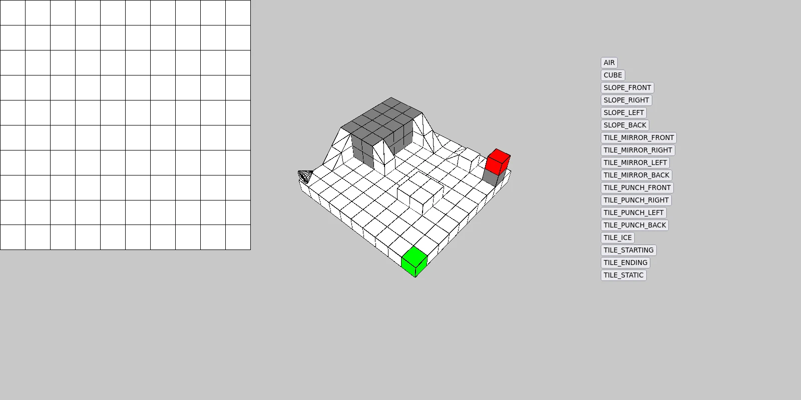

+++
authors = ["William Guimont-Martin"]
title = "Rolly Dango"
description = "A game about rolling"
date = 2022-01-17
# updated = ""
# draft = false
[taxonomies]
tags = ["Gamedev", "Dango"]
[extra]
# banner = ""
# toc = true
toc_inline = true
toc_ordered = true
# trigger = ""
# disclaimer = ""
+++

Rolly Dango, an isometric rolling puzzle made with <a class="external" href="https://wasm4.org/" target="_blank">WASM-4</a>. We made it for the <a class="external" href="https://itch.io/jam/wasm4" target="_blank">WASM-4 Game Jam</a>.

<a class="external" href="https://willguimont.github.io/rolly-dango/" target="_blank">Try the game here</a> or on <a class="external" href="https://willguimont.itch.io/rolly-dango" target="_blank">itch.io</a>!

Source code is here: <a class="external" href="https://github.com/willGuimont/rolly-dango" target="_blank">willGuimont/rolly-dango</a>

Here's some key points of our project:

- We made our own ECS (entity-component-systems) from scratch
- To save cartridge space, we built our own Huffman coding algorithm
- To help ourselves make levels, we built our own level editor using <a class="external" href="https://p5js.org/" target="_blank">p5.js</a>
- Made all of our sprites using <a class="external" href="https://www.aseprite.org/" target="_blank">Aseprite</a>

Our level editor:

