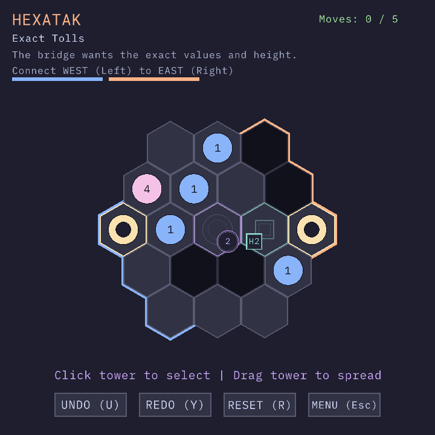
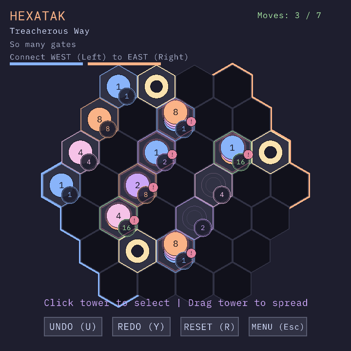

+++
authors = ["William Guimont-Martin"]
title = "Hexatak"
description = "A hex-grid puzzle about merging and stacking stones to build a road across the board"
date = 2026-07-10
[taxonomies]
tags = ["Gamedev", "Puzzle", "C", "raylib"]
[extra]
banner = "thumbnail.png"
toc_inline = true
toc_ordered = true
+++

`Hexatak` is a hex-grid puzzle about merging and stacking stones to build a contiguous road between two board edges. It was made in C for the [raylib 6.x game jam](https://itch.io/jam/raylib-6x-gamejam), built around the themes `hex` and `merge`, and loosely inspired by the stack movement ideas in [Tak](https://en.wikipedia.org/wiki/Tak_(game)).

You move whole stacks one tile at a time, spread towers across multiple cells, merge matching values, and satisfy bridge conditions before running out of moves. Later levels add gates that require specific stone values or exact stack heights, so the puzzle is not just about reaching the other side, but about routing the right road with the right pieces.

**Play it here:** [willguimont.com/cgame/hexatak](https://willguimont.com/cgame/hexatak_classic/)

**Also on itch.io:** [willguimont.itch.io/hexatak](https://willguimont.itch.io/hexatak)

**Source code:** [github.com/willGuimont/cgame](https://github.com/willGuimont/cgame)

## What is in the game

- 18 handcrafted puzzle levels with escalating mechanics
- Stack movement, stack spreading, and value merges
- Blocked cells, fixed bridge anchors, value gates, and height gates
- A built-in level editor used to design and test puzzles
- Debug-only tooling for checking solvability and loading levels quickly during development

## How it plays

The goal in each puzzle is to create a valid connected road between two board edges.

- Move a whole stack one tile at a time
- Spread a tower across multiple cells in one direction
- Merge stones with matching values
- Meet exact bridge conditions within the level move limit

This leads to puzzles where the shape of the path matters, the value distribution matters, and sometimes even the exact height of a stack matters.

## Controls

Mouse:

- Left click a stack, then left click a target cell to move it one step
- Left click and drag from a stack to spread it in a direction
- Right click to cancel the current selection
- Use the on-screen buttons for undo, redo, reset, and other actions

Keyboard:

- `U`: undo
- `Y`: redo
- `R`: reset the current level
- `Esc`: return to the menu or leave the editor
- `Space` / `Enter`: advance dialogs and continue after a cleared level

## Screenshots

  
  

  
  

